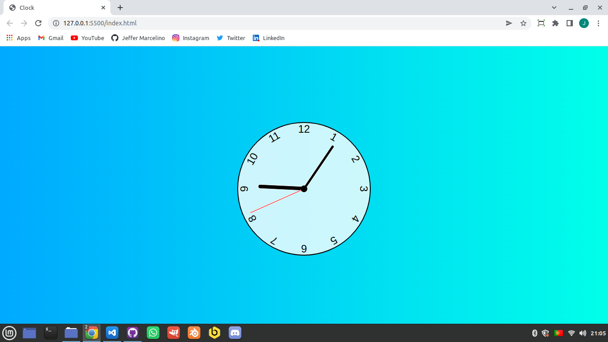

<h1>Javascript Analog Clock</h1>

 

## Preview:

  

## 🚀 Tecnologias

Esse projeto foi desenvolvido com as seguintes tecnologias:

- HTML
- CSS
- JavaScript

## 💻 Projeto

Este é um simples relogio analogo que é atualizado em tempo real sem precisar de recarregar a página.

## 📝 Licença

Esse projeto está sob a licença MIT. Veja o arquivo [LICENSE](./LICENSE) para mais detalhes.

---

Feito por ♥ :wave: [Jeffer Marcelino!](https://github.com/JefferMarcelino/)
